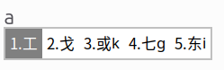
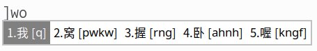

[English](README.md) | **中文**

# FreeWubi

一款适用于 Linux Fcitx5 的五笔 86 输入法引擎。易于安装，易于使用 —— 通过五笔编码输入中文，并提供拼音反查、临时英文等便捷快捷键。所有触发键均可自定义。

## 目录

- [简介](#简介)
- [快速开始](#快速开始)
- [文档](#文档)
- [开发者](#开发者)
- [支持的平台](#支持的平台)
- [许可证](#许可证)

## 简介

FreeWubi 是一款简单易用的 Linux 五笔 86 输入法 —— 适合快速中文输入，支持中英文无缝切换和拼音反查：

- **五笔 86 输入** —— 按频率排序候选词，支持前缀匹配，编码唯一时自动上屏

  

- **临时拼音反查** —— 忘了某个字的五笔编码？输入拼音即可查找，每个候选词旁显示对应的五笔编码

  

- **临时英文模式** —— 无需切换整个输入法，直接输入简短英文
- **斜杠模式** —— 快速输入路径和命令（如 `/usr/bin`），无需切换到英文模式
- **自定义词组** —— 自定义编码与词组的映射
- **Z 键重复** —— 按下 `z` 即可重新上屏上一个五笔字
- **两级字典** —— 默认显示常用字；输入过程中按 `` ` `` 可切换到生僻字模式
- **中文标点** —— 逗号、句号、引号等自动转换为中文标点
- **按键完全可配置** —— 所有触发键（临时拼音、临时英文、斜杠模式等）均可在 Fcitx5 设置中重新映射

> 完整的按键绑定参考，请参阅[使用指南](docs/usage.zh-CN.md)。

## 快速开始

### 1. 安装 Fcitx5（如尚未安装）

```bash
sudo apt install -y fcitx5 fcitx5-chinese-addons \
  fcitx5-frontend-gtk3 fcitx5-frontend-gtk4 \
  fcitx5-frontend-qt5 fcitx5-config-qt im-config

im-config -n fcitx5
```

注销并重新登录。

### 2. 下载并安装 FreeWubi

从 [Releases](https://github.com/zli/FreeWubi/releases) 页面下载最新的压缩包并解压：

```bash
tar xzf freewubi-v0.1.0-linux-x86_64.tar.gz -C ~/.local
```

### 3. 告诉 Fcitx5 插件的位置

Fcitx5 默认不会搜索 `~/.local/lib/fcitx5/` 目录。需要创建或更新 `~/.xinputrc`：

```bash
cat > ~/.xinputrc << 'EOF'
export FCITX_ADDON_DIRS=/usr/lib/x86_64-linux-gnu/fcitx5:$HOME/.local/lib/fcitx5
run_im fcitx5
EOF
```

### 4. 启用 FreeWubi

1. 运行 `fcitx5-configtool`
2. 点击 **添加输入法** → 搜索 **FreeWubi** → 添加
3. 使用 `Ctrl+Space` 切换到 FreeWubi
4. 按下 `a` —— 应该能看到候选词，如 `1.工 2.戈`

> 更多详情、故障排除和从源码构建，请参阅[安装指南](docs/installation.zh-CN.md)。

## 文档

| 文档 | 说明 |
|---|---|
| [安装指南](docs/installation.zh-CN.md) | 从 Release 安装、从源码构建、故障排除 |
| [使用指南](docs/usage.zh-CN.md) | 所有按键绑定、模式和中文标点表 |

## 开发者

FreeWubi 采用三层架构（Fcitx5 适配层 → 引擎逻辑 → 字典），核心逻辑无需 Fcitx5 即可完整测试。

```bash
# 克隆并构建
git clone https://github.com/zli/FreeWubi.git
cd FreeWubi/fcitx5-plugin
cmake -B build -DBUILD_TESTING=ON -DCMAKE_BUILD_TYPE=Debug
cmake --build build
cd build && ctest --output-on-failure
```

架构详情、代码风格、CI 工作流和贡献指南，请参阅[开发指南](docs/development.zh-CN.md)。

## 支持的平台

| 发行版 | 最低版本 |
|---|---|
| Ubuntu | 22.04 |
| Debian | 12 |
| Fedora | 38 |
| Arch Linux | 滚动更新 |
| openSUSE | Leap 15.5 / Tumbleweed |

任何提供 Fcitx5 和 GCC 12+ 的发行版均可使用。

## 许可证

[Apache 2.0](LICENSE)

## 致谢

五笔 86 字典基于广泛使用的
[rime-wubi86-jidian](https://github.com/KyleBing/rime-wubi86-jidian)（作者 KyleBing，
Apache 2.0 许可）。
